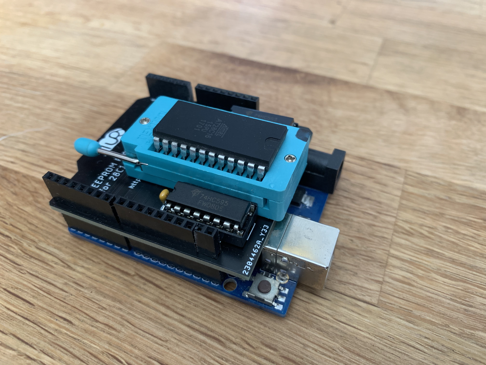

############
EEPROgraMmer
############

*************************
Arduino EEPROM Programmer
*************************

Universal Programmer for parallel EEPROMS using a python CLI and
a simple Arduino with 2 shift-registers to interface the EEPROM.

Based on the [Arduino Code](https://github.com/beneater/eeprom-programmer) written by [Ben Eater](https://eater.net).

Install
-------

1. ``pip install eepro``
2. Flash an Arduino with the sketch in ``Arduino/EEPROgraMmer``
3. Connect the Arduino to the external components following the schematic.

*********
Schematic
*********

Check out the [original project](https://github.com/beneater/eeprom-programmer)

There is also a Autodesk Eagle Project with pregenerated Gerbers in the Boards directory. This Board holds the 2 Shift Registers and has a place for a ZIF Socket.

********
Synopsys
********

.. code::

    usage: eepro [-h] -p PORT [-f FILE] [-b BAUD] [-s SIZE] [-w | -r] [-v] [-c]
                [--check-empty]

    Write to or read from an EEPROM

    optional arguments:
    -h, --help            show this help message and exit
    -p PORT, --port PORT  serial port to the programmer
    -f FILE, --file FILE  binary file to write
    -b BAUD, --baud BAUD  baudrate for communication with the programmer
    -s SIZE, --size SIZE  size of the EEPROM in bytes
    -w                    write <file> to the EEPROM
    -r                    read the contents of the EEPROM into file
    -v                    verify file contents after writing
    -c                    clear the EEPROM (with 0xff bytes) before writing or
                            reading
    --check-empty         make sure the EEPROM is empty (filled with 0xff)

********
Examples
********

Clear an EEPROM
---------------

Clear the first 2048 bytes of the EEPROM and read back to make
sure they are set accordingly

.. code::

    ./eepro --port /dev/tty.wchusbserial1440 -c --check-empty -s=2048

Write a binary file to the EEPROM
---------------------------------

The following command will clear the EEPROM, write the contents
of ``firmware.bin`` and reads back the content

.. code::

    ./eepro --port /dev/tty.wchusbserial1440 -cvwf firmware.bin -s=2048

Dump EEPROM Contents
--------------------

Read the first 2048 bytes of the EEPROM and write the result into
``firmware.bin``. The content is then read again to check against errors.

.. code::

    ./eepro --port /dev/tty.wchusbserial1440 -vrf firmware.bin -s=2048
